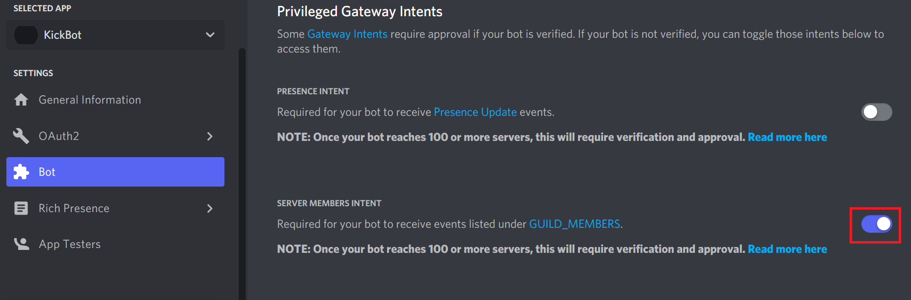

# discord_bot
How to install 
```bash
pip3 install discord.py
```

Google search "Discord new application"

**Generate bot URL**
follow the instruction on the link below:
https://discordjs.guide/preparations/adding-your-bot-to-servers.html#bot-invite-links


When you execute the code below, when you said something !hello
The robot will response "Command executed"

```python
from discord.ext.commands import Bot

bot = Bot("!")

@bot.command()
async def hello(ctx):
    await ctx.send("Command executed")
    

bot.run('token')
```

And since you need to query all the member information, you need to turn on the setting **SERVER MEMBERS INTENT**

